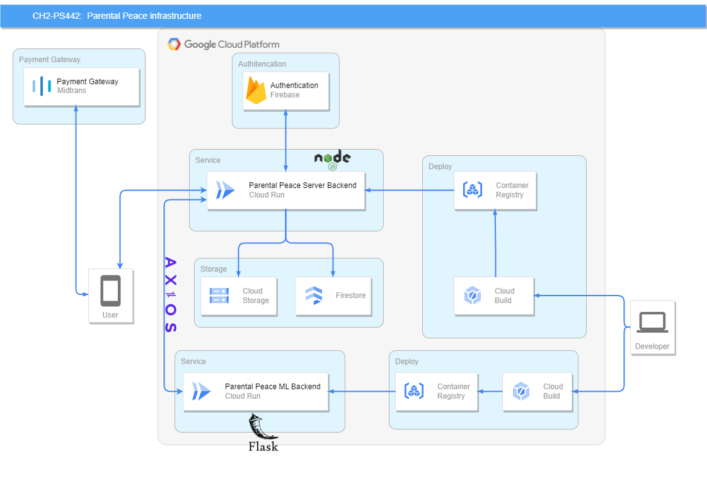

# Cloud Infrastructure


## Authors by Team ID: `CH2-PS442`
| Name | Bangkit-ID     | Github-Profile                       |
| :-------- | :------- | :-------------------------------- |
| I Putu Yogi Prasetya Dharmawan      | `M014BSY1124` | [@YogiPrasetyaD](https://github.com/YogiPrasetyaD) |
| Mhd Iqbal Pratama      | `M302BSY0044 ` | [@MhdIqbalPratama](https://github.com/MhdIqbalPratama) |
| Luthfi Dhiya Ramadhan      | `M237BSY0835 ` | [@LuthfiDhiyaRamadhan](https://github.com/LuthfiDhiyaRamadhan) |
| I Putu Dhiandika Aditya Permana      | `C014BSY4164` | [@Dhiandika](https://github.com/Dhiandika) |
| Yoga Pratama      | `C116BSY4186 ` | [@Yoama2](https://github.com/Yoama2) |
| I Wayan Priatna      | `A014BSY2686 ` | [@priatna1054](https://github.com/priatna1054) |

# API Documentation

This document provides information on how to use the API endpoints and their functionalities.

# Setup Project
To run this project, install it locally using npm on your pc
```
# clone repository
$ git clone https://github.com/Dhiandika/Parental_Peace.git

# change directory to server
$ cd server
```
Please go to Google Cloud Console and create a service account with permissions for both Storage Object Admin and Storage Object Viewer

### Create private file and your key.json
```
{
    "api_key":"",
    "storage_bucket": "parental-peace2023",
}
```

### Import file key firebase and fire store to private file 
This folder is used to store 2 file including firebase-config.js and serviceAccount.json. Use serviceAccount.json from Google Cloud Project
```
- In firebase create project => Go to project setting and in sevice account "Generate new private key"
- In Google Cloud Platform go to the IAM & Admin (if dont have project go make one) => go to service account and create a service account for the admin cloud => after create the service account go and clict the service account that have been made => go to key section and add key and then create new key

-after done 2 task above the file json that have downloaded store in private folder
```
## Endpoint Routes
There are 5 Catagory for the Preconditions

- `Prediction_bellypain-result`

- `Prediction_burping-result`

- `Prediction_discomfort-result`

- `Prediction_hungry-result`

- `Prediction_Tired-Results`


| Route                           | HTTP Method | Description                                  |
|---------------------------------|-------------|----------------------------------------------|
| /users                          | GET         | Get all users                                |
| /users/{{idUser}}               | GET         | Get users by Id                              |
| /users                          | POST        | Add user                                     |
| /users/{{idUser}}               | PUT         | Update users                                 |
| /users/{{idUser}}               | DEL         | Delete users                                 |
| /articles                        | GET         | Get all articles                              |
| /articles/{{idarticles}}          | GET         | Get articles by Id                            |
| /articles                        | POST        | Add articles                                  |
| /articles/{{idarticles}}          | PUT         | Update articles                               |
| /articles/{{idarticles}}          | DEL         | Delete articles                               |
| /getDocuments                    | GET         | Get all Prediction                          |
| /random_[katagori]_results   | GET         | Get random katagori result                         |
| /[katagori]-result                    | POST        | Add [katagori]-result                              |
| /[katagori]-result/{{idprediction}}    | PUT         | Update [katagori]-result by id                           |
| /[katagori]-result/{{idprediction}}    | DEL         | Delete [katagori]-result by id                           |

## Documentation for this API
To see all documentation for this API 
- Go to here for all documentation=> `https://documenter.getpostman.com/view/28165109/2s9YkgBjHD`
- Go to here the Prediction => `https://documenter.getpostman.com/view/28165109/2s9YkgE6Bd`
- Go to here the Prediction Prediction_bellypain-result => `https://documenter.getpostman.com/view/28165109/2s9YkgE6Be`
- Go to here the Prediction Prediction_burping-result => `https://documenter.getpostman.com/view/28165109/2s9YkgE6Bg`
- Go to here the Prediction Prediction_discomfort-result => `https://documenter.getpostman.com/view/28165109/2s9YkgE6Bi`
- Go to here the Prediction Prediction_hungry-result => `https://documenter.getpostman.com/view/28165109/2s9YkgEQym`
- Go to here the Prediction Prediction_Tired-Results => `https://documenter.getpostman.com/view/28165109/2s9YkgEQyn`


## Endpoints
All requests to the Users API must include the `x-api-key` header with a valid API key.

 And here are example how to use it

###  Register User
Create User Account

#### `POST /register`

##### Request
- Method: POST
- Body:
  - `username` as String: Name of the user
  - `email` as String: Email of the user
  - `phone` as String: Phone number of the user
  - `password` as String: Password for the user

##### Response
- Status Code: 200 OK

##### Example Response
```json
{
    "error": false,
    "message": "Register Success"
}
```

###  Login User
Login User Account

#### `POST /login`

##### Request
- Method: POST
- Body:
  - `email` as String: Email of the user
  - `password` as String: Password for the user

##### Response
- Status Code: 200 OK
- Body: User object

##### Example Response
```json
{
    "error": false,
    "message": "Login Success",
    "loginResult": {
        "userId": "fWyb3CK1w13W3NX3bBZF",
        "name": "Dhiandika",
        "email": "npemburu6@gmail.com",
        "phone": "081339035284",
        "token": "04seARXEsHZBhsTtCxfQ9XQuSTn1"
    }
}
```

### 1. Get All Users

#### `GET /users`

Retrieve information about all users.

##### Request

- Method: GET
- Headers:
  - `x-api-key`: Your API Key

##### Response

- Status Code: 200 OK
- Body:
  - `users`: An array of user objects.

##### Example Response

```json
{
    "users": [
        {
            "3byMJWXnaseHKBh1NIZA": {
                "password": "$2b$05$XIc9dcDztTO0WP4bLTTyROza6uwafsYNiD97ijDrLBKuwYclQyYwm",
                "user_id": "3byMJWXnaseHKBh1NIZA",
                "phone": "081339035284",
                "firebase_uid": "DaKUUaKcxVM6SFjDs1cc6ZmAC4a2",
                "email": "npemburu4@gmail.com",
                "username": "Dhiandika"
            }
        },
        {
            "RjB7SlbDqu9zMMwmxF45": {
                "password": "$2b$05$xxEKLPb/3my8MRPoT.XQ.uqfT8SW/u.NznG2S9dI7nIVeFbXSl74K",
                "user_id": "RjB7SlbDqu9zMMwmxF45",
                "phone": "081339035284",
                "firebase_uid": "gcNxoX89uefFfPqqGXrCO1LejFi2",
                "email": "wayan123@gmail.com",
                "username": "Wayan"
            }
        },
        {
            "fWyb3CK1w13W3NX3bBZF": {
                "password": "$2b$05$2EZoMbAnR2RvV2MiLjr.g.9E2ogNzPnMjpygzo0N3LEpTT64Zz8bq",
                "user_id": "fWyb3CK1w13W3NX3bBZF",
                "phone": "081339035284",
                "firebase_uid": "04seARXEsHZBhsTtCxfQ9XQuSTn1",
                "email": "npemburu6@gmail.com",
                "username": "Dhiandika"
            }
        },
        {
            "kmkrG4IoWtUXl9TiZD3w": {
                "password": "$2b$05$hPb3kJdxJdZ5YqOmPgwjKO6V.mqnKLNx9dJ5epKVqwrp5hgpGWIFy",
                "user_id": "kmkrG4IoWtUXl9TiZD3w",
                "phone": "081339035284",
                "firebase_uid": "8kHnv9tTC6OFMdfR49XcqnZeT7q2",
                "email": "npemburu34@gmail.com",
                "username": "Dhiandika"
            }
        }
    ]
}
```

###  Get User by ID

#### `GET /users/{id}`

Retrieve information about a specific user identified by their ID.

##### Request

- Method: GET
- Headers:
  - `x-api-key`: Your API Key
- Path Parameters:
  - `id`: The ID of the user

##### Response

- Status Code: 200 OK
- Body: User object

### 3. Create New User

#### `POST /users`

Create a new user.

##### Request

- Method: POST
- Headers:
  - `x-api-key`: Your API Key
- Body Parameters:
  - `users_name`: Name of the user
  - `users_email`: Email of the user
  - `users_phone`: Phone number of the user
  - `users_role`: Role of the user
  - `users_password`: Password for the user
  - `users_picture`: User profile picture (multipart/form-data)

##### Response

- Status Code: 200 OK
- Body:
  - `status`: "success"

### 4. Update User by ID

#### `PUT /users/{id}`

Update information for a specific user identified by their ID.

##### Request

- Method: PUT
- Headers:
  - `x-api-key`: Your API Key
- Path Parameters:
  - `id`: The ID of the user
- Body Parameters:
  - `users_name`: Updated name of the user
  - `users_email`: Updated email of the user
  - `users_phone`: Updated phone number of the user
  - `users_role`: Updated role of the user
  - `users_picture`: Updated user profile picture (multipart/form-data)

##### Response

- Status Code: 200 OK
- Body:
  - `status`: "success"

### 5. Delete User by ID

#### `DELETE /users/{id}`

Delete a specific user identified by their ID.

#### Request

- Method: DELETE
- Headers:
  - `x-api-key`: Your API Key
- Path Parameters:
  - `id`: The ID of the user

#### Response

- Status Code: 200 OK
- Body:
  - `status`: "success"

## Deploying to Cloud Run
- ### Preconditions
  Before deploying your app to Google Cloud Run, ensure that you meet the following prerequisites:
  - Create a Google Cloud Platform (GCP) account and manage projects.
  - Install and configure the Google Cloud SDK on your local machine.
  Please note that "prerequisites" is a plural noun, so it is more appropriate to use "meet the following prerequisites" instead of "meet the following prerequisite" in this context.

- ### Steps
  - Prepare the application
    Ensure that your application is ready for deployment on Google Cloud Run. This involves conducting local testing and ensuring that the necessary configuration is in place.
  - Create a container image
    Google Cloud Run requires the application to be packaged as a distributable container image. Build container images of your applications using tools like Docker.
  - Upload the container image
    Upload the container image you created to the Google Container Registry (GCR) using the gcloud command. Before proceeding, ensure that you are signed in to the correct Google Cloud Platform (GCP) account.
    Example command to upload a container image:
    ```
    gcloud builds submit --tag gcr.io/[PROJECT-ID]/[IMAGE-NAME]
    ```
  - Deploy to Google Cloud Run
    Use the gcloud run deploy command to deploy your application to Google Cloud Run. Specify the service name, select the uploaded container image, and configure any additional options as necessary.
    Example command to deploy an application to Google Cloud Run:
    ```
    gcloud run deploy [SERVICE-NAME] --image gcr.io/[PROJECT-ID]/[IMAGE-NAME] --platform managed
    ```
  - Accessing the application
    After the deployment process is complete, you will receive a URL that provides access to the deployed application. Utilize this URL to access the app through a web browser or by employing an API testing tool such as cURL or Postman.


## Datasets

Dataset Links of This Project :

- [Dataset 1](#)
- [Dataset 2](#)


## UI/UX Design

- Link Lo-Fi Design : [Prototype](https://www.figma.com/file/stmmEOu6LeH6BLNDg4UP1a/Baby-Blues-Project-(Copy)?type=design&node-id=0%3A1&mode=design&t=ehEoacbj6koN2Xfp-1)
- Link Hi-Fi Design : [Wireframe & Mockup](https://www.figma.com/file/stmmEOu6LeH6BLNDg4UP1a/Baby-Blues-Project-(Copy)?type=design&node-id=302-2&mode=design)
- Link Prototype Design : [Refrensi](https://www.figma.com/file/stmmEOu6LeH6BLNDg4UP1a/Baby-Blues-Project-(Copy)?type=design&node-id=226-2&mode=design)

## Deployment Link APK Parental Peace

Download Link APK Parental Peace:<br>
[Parental Peace APK (Google Drive)](#)


## Languages and Tools:
<p align="left"> <a href="https://developer.android.com" target="_blank" rel="noreferrer">  </a> <a href="https://www.w3schools.com/css/" target="_blank" rel="noreferrer">  </a> <a href="https://www.docker.com/" target="_blank" rel="noreferrer">  </a> <a href="https://www.figma.com/" target="_blank" rel="noreferrer">  </a> <a href="https://firebase.google.com/" target="_blank" rel="noreferrer">  </a> <a href="https://flask.palletsprojects.com/" target="_blank" rel="noreferrer">  </a> <a href="https://cloud.google.com" target="_blank" rel="noreferrer">  </a> <a href="https://git-scm.com/" target="_blank" rel="noreferrer">  </a> <a href="https://www.w3.org/html/" target="_blank" rel="noreferrer">  </a> <a href="https://developer.mozilla.org/en-US/docs/Web/JavaScript" target="_blank" rel="noreferrer">  </a> <a href="https://kotlinlang.org" target="_blank" rel="noreferrer">  </a> <a href="https://postman.com" target="_blank" rel="noreferrer">  </a> <a href="https://www.python.org" target="_blank" rel="noreferrer">  </a> <a href="https://www.tensorflow.org" target="_blank" rel="noreferrer">  </a> </p>

###

🔥 Supported By

###

<div align="center">
  
  
  
</div>

###
